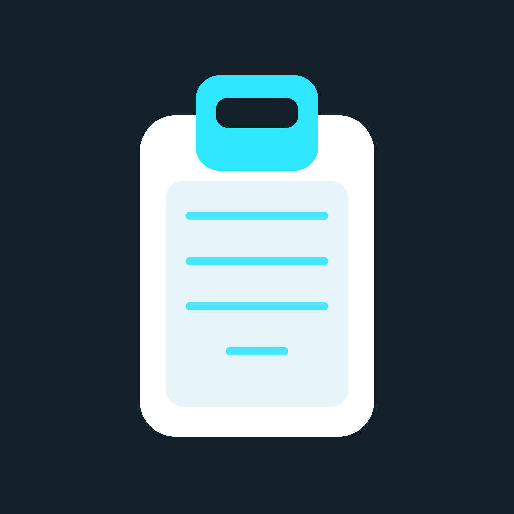
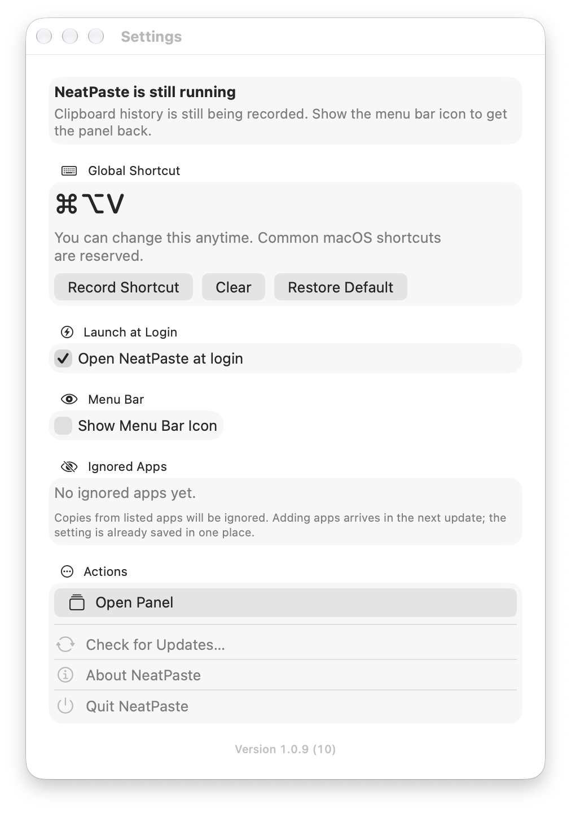

**语言：** [English](README.md) | 简体中文

# NeatPaste

<p align="center">
  
</p>

NeatPaste 是一款 **macOS 剪贴板历史管理器**。它待在菜单栏，记下你复制过的内容，用全局快捷键唤出面板，把选中的一条粘贴回你刚才正在输入的应用。

This is a macOS clipboard history manager, unrelated to the iOS text-cleaning app of the same name.（本产品是 macOS 剪贴板历史工具，与同名 iOS 文本清理应用无关。）

**需要 macOS 26 或更高版本，Apple 芯片。** MIT 开源。历史只留在这台 Mac 上--没有账号、没有同步、不联网。

<!-- 截图待补：将面板图与设置窗图存入 docs/images/ 后取消注释
<p align="center">
  
  
</p>
-->

## 安装

目前还没有已签名的安装包。请从源码构建：

1. 安装 Xcode 26+ 和 [XcodeGen](https://github.com/yonaskolb/XcodeGen)。
2. 克隆本仓库。
3. 在仓库根目录执行：

```bash
xcodegen generate
xcodebuild -project NeatPaste.xcodeproj -scheme NeatPaste -configuration Release \
  -destination 'platform=macOS' -derivedDataPath build/DerivedData build
rm -rf /Applications/NeatPaste.app
ditto build/DerivedData/Build/Products/Release/NeatPaste.app /Applications/NeatPaste.app
open /Applications/NeatPaste.app
```

然后点菜单栏图标，或按 **⌘⌥V**。

## 用法

1. 按 <kbd>⌘</kbd>+<kbd>⌥</kbd>+<kbd>V</kbd>（或点菜单栏图标）打开面板，默认已选中最新一条。
2. 打字即筛选；<kbd>↑</kbd> / <kbd>↓</kbd> 移动选择；<kbd>回车</kbd>粘贴回你刚才正在输入的应用；<kbd>空格</kbd>用系统快速看预览，<kbd>Esc</kbd> 或点面板外关闭。
3. <kbd>⌘</kbd>+<kbd>,</kbd> 打开设置：全局快捷键、开机自启（默认关闭）、忽略的应用（下一波接入）。
4. 自动按粘贴键需要辅助功能授权。没有授权时，仍会把条目写入系统剪贴板，你可以自己按 <kbd>⌘</kbd>+<kbd>V</kbd>。

## 功能

- 键盘优先：打开、筛选、粘贴全程不碰鼠标
- 文本与图片同列，图片出缩略图，不降级内容格式
- 相同内容自动去重，再复制则顶到最上
- 历史保留 7 天，重启不丢，只存在这台 Mac 上
- 面板出现在输入光标附近

## 明确不做

钉住、收藏、云同步、AI、其它平台、商店版，以及把富内容降成纯文本。

## 许可证

[MIT](LICENSE)
